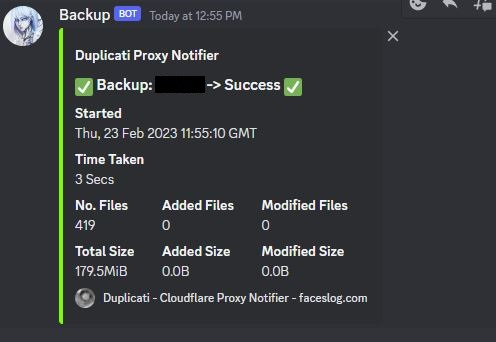
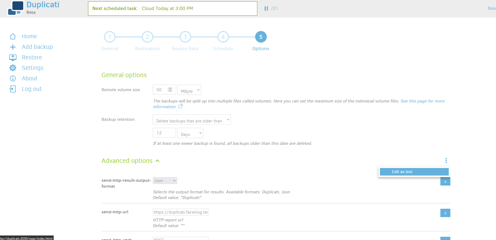

# 💾 Cloudflare Worker Duplicati Discord Notifications

This Cloudflare worker provides an endpoint for Duplicati backups that proxies notifications to a Discord channel using a webhook. With this worker, you can ensure that you receive notifications for all of your backup events. If you'd like to host your own worker or use the example one, follow the instructions below.

You can use the example one at: https://duplicati.faceslog.tech/



*Note is `./assets/example_data.json` you can see what data Duplicati sends if you ever wish to tweaks the script*

## A- Create the Webhook URL

<br/>

**1-** Start by creating a Discord webhook in the channel where you want to receive notifications. If you're not sure how to do this, Discord's support page provides a [detailed guide](https://support.discord.com/hc/en-us/articles/228383668-Intro-to-Webhooks) on how to create a webhook.

**2-** Once you've created the webhook, copy the URL and keep only the part after `https://discord.com/api/webhooks/`. <br>

For example, if your webhook URL is: 
```
https://discord.com/api/webhooks/123456789012345678/abcdefgHIJKLMNOPQRStuvwxyz0123456789`
```

You should keep only:
```
123456789012345678/abcdefgHIJKLMNOPQRStuvwxyz0123456789
```
This part of the URL represents the `channelId/webhookId`.

**3-** Add a name to identify your backup `MyBackUpName/channelId/webhookId`. This name will be displayed in the webhook embed.

**4-** Append `MyBackUpName/channelId/webhookId` to `https://duplicati.faceslog.tech/api/`.

The URL should look like this: 
```
https://duplicati.example.org/api/MyBackup/123456789012345678/abcdefgHIJKLMNOPQRStuvwxyz0123456789
```

## B- Add it to duplicati
<br/>

To add the notification URL to Duplicati, follow these steps:

**1-** Go to the Duplicati WebUI and select the backup you want to receive notifications for.

**2-** Click on the "Edit" button to edit the backup configuration.

**3-** In the "Options" section, click on the three dots next to "Advanced options" and select "Edit as text".



**4-** Add the following lines to the configuration:

```
--send-http-verb=POST
--send-http-url=https://duplicati.example.org/api/MyBackup/123456789012345678/abcdefgHIJKLMNOPQRStuvwxyz0123456789
--send-http-result-output-format=Json
```

*Note that `--send-http-url` should be the URL you created in the previous step.*

**5-** Save the configuration file and you're all set!

Your backup should now send a notification to the Discord channel you set up whenever it runs. If you want to receive notifications for multiple backups, you can repeat the steps for each backup and create a unique URL for each one.

## Deploy your own worker: 

If you'd like to host your own webhook endpoint instead of using the example one, you can follow these steps:

**1-** Clone this repository:

```
git clone https://github.com/faceslog/cf-worker-duplicati.git
```

**2-** Install the required dependencies by running `npm install`.

**3-** Edit the `wrangler.toml` file by replacing example.org with your own domain name. You'll also need to add your Cloudflare account ID, which you can find in the Cloudflare dashboard. (https://developers.cloudflare.com/fundamentals/get-started/basic-tasks/find-account-and-zone-ids/)

For more detailed instructions on how to configure your Cloudflare worker, please see the [official documentation](https://developers.cloudflare.com/workers/wrangler/configuration/).

**4-** Once you've configured your worker, you can deploy it by running `npm run publish`.

After your worker is deployed, you can use the URL it provides to set up notifications in Duplicati, as described in the previous section of this README. (Make sure to use the same domain as the one in your wrangler.toml)

## Others

Don't hesitate to message me for any problem with it, feel free to make a pull request to improve it !

Another project that does the same thing using Google Cloud Platform: https://github.com/jameslloyd/duplicati-discord-notification (I try to avoid google services 😅)
